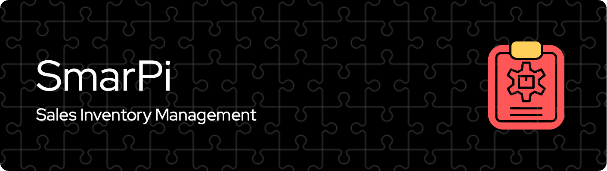

## About
SmartPi is a sales inventory management developed for AppleHome, a fictional store inspired by a real small and medium enterprise (SME) business in Bantul, the Special Region of Yogyakarta. Because this inventory management was designed to access and update the sales inventory, not everyone should be able to operate the application (find the dummy credentials below).

## Credentials

> [!IMPORTANT] 
> For security purposes, only two roles are given the access. Here are dummy credentials that can be used to operate the application.

    admin: admin1234
    manager: password1234

## Main features
1. <b>Display items</b>: This feature allows users to see available items by different options such as all items, low-stock items, brand-new or second-hand items. 
2. <b>Add a new item</b>: Users can add a new entry to the existing data.
3. <b>Modify an item</b>: Users have an option to modify an existing item based on the item ID and they are free to select which item detail(s) to update.
4. <b>Remove an item</b>: An item removal can be performed once the users specify which item ID to remove from the database. 
5. <b>Exit and log out</b>: For security purposes, this program is complemented with the exit menu. Once the users exit, they will be automatically logged out, and they will need to login when they want to operate the app again. 

## Project Organization
    .
    ├── README.md            <- The top-level README for developers using this project.
    ├── docs
    │   └── requirements.txt <- The requirements file for reproducing the env. 
    |                            Generated using `pip freeze > requirements.txt`
    └── src                  <- Source codes
        ├── __main__.py      <- The main file used to run the program.
        └── inventory.py     <- The module file containing the functions.

## Installation
To clone this project, execute the following line of code on your terminal.

    git clone https://github.com/LingAdeu/Sales-Inventory-Management-App.git

## Collaboration
Feel free to contact me for collaboration here:

  